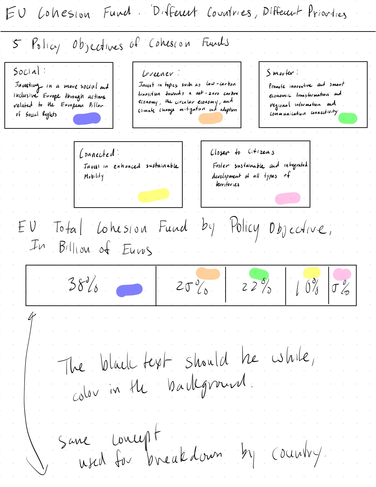
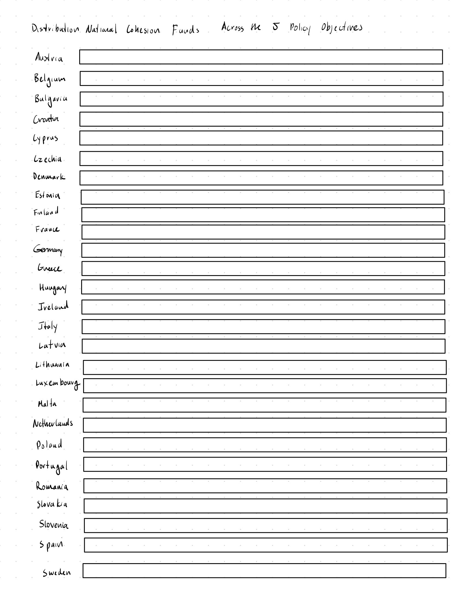

| [home page](https://vincentwang510.github.io/Vincent-Wang-Telling-Stories-With-Data/) | [visualizing debt](visualizing-government-debt) | [critique by design](critique-by-design) | [final project I](final-project-part-one) | [final project II](final-project-part-two) | [final project III](final-project-part-three) |

# Revamping the European Cohesion Fund Data Set  

## Step one: the visualization

Original link to the page and data: https://data.europa.eu/en/publications/datastories/open-data-enabler-regional-development-and-better-cohesion-europe

I selected this dataset because it initially appeared complex, and I wanted to challenge myself with a more intricate analysis. I was also drawn to the European Union's commitment to five key initiatives aimed at improving Europe, as it highlights the need for multilateral cooperation among all member states—a concept I find particularly compelling-since working together in 2024 does not seem to be a common trend within the United States. What also stood out to me was how progressive these five policies are. They focus on creating a more socially inclusive Europe, tackling climate change, enhancing digital connectivity, improving transportation through smarter infrastructure, and promoting sustainability across the continent. I'm genuinely inspired by the forward-thinking approach of these European initiatives, especially as I reflect on how much more could be done in these areas in my own country.

## Step two: the critique
### Describe your overall observations about the data visualization here.  What stood out to you?  What did you find worked really well?  What didn't?  What, if anything, would you do differently?   

The first thing that stood out to me is the initial design of the visual. The first though is that 2/3 of the visual overshadowed the last 1/3 of the visual. The designers placed the legend and the large horizontal stacked bar graph in on the top. I understand that the designers wanted the legend and the main stacked bar graph as the graph that jumps out. However, the title states:  "Distribution of EU and National Cohesion Funds Across the 5 Policy Objectives," and the stacked bar graph representing the EU is hidden below everything. I would either move the EU bar graph under the legend and above the main bar graph. This can set a story where you can see the overall distributions of funds within the EU followed by the individual nation's breakdown. 

I really liked the horizontal stacked bar graph. It was very simple and easy on the eyes. The colors for each stacked bar works well as there is no contextual meaning behind the color. In this case, I am referring to red = bad or green = good. The legend itself is color coded and has a short explanation of what each color means. Each respective color is then used in the stacked bar graph. One thing I did not is that within the legend, there is either a typo or a mistake where the description for "connected" and "closer to citizens" are the same. In connected, I think they meant to say "enhanced sustainable mobility." 

Additionally, I don't like the design choice to use a similar, darker color to highlight the title of each legend color. I think they should have used a white to contrast the background color. This issue is also present when they label the percentage distribution of each bar within a stack. I would just use a white color. I would also move the names of each country outside of the bar stack and onto the y axis. 

Personally, I think the design is aesthetically pleasing as it is simple and easy on my eyes. There are some tweaks to design that I would like to change, but it is good nonetheless. I would say that this graph is complete enough for the viewer to understand the message that the graph is trying to convey, however, I am not sure if this distribution is towards a centralized EU fund or are each country individually funding each policy objective within their country. The visual is truthful, I am sure that if someone wanted to, they could find the dataset used within the visual. I do not expect the EU to skew any data. In terms of engagement, the viewer will need to click on the attached links above the visual to learn more about each policy initiative as the visual itself only provides some contextual hints on each policy initiative. 

### Who is the primary audience for this tool?  Do you think this visualization is effective for reaching that audience?  Why or why not? 

The primary audience for this tool appears to be policymakers, regional development practitioners, and stakeholders involved in urban planning, economic development, and sustainability initiatives within the European Union. Also, it may be open to the average person who is interested in the EU's policies on economic growth and fostering sustainable development. I think that for policy makers, it is a good tool to to see a country's overall breakdown of the distribution made into each policy initiative. Its very simple and allows for the policy maker to see what policies each country has invested the most in/least in. For a regular viewer The visual itself shows what what unique pattern of policy objectives that each EU nation prioritizes and a short summary of the goals of each policy. I think overall, it does a good job for both audiences, its simple for policy makers to track progress and simple enough for regular people to understand and provides simple context may interests lead the viewer to look up each policy more in depth. 

## Step three: Sketch a solution

## Step four: Test the solution

The basic questions I asked: 
1. Can you tell me what you think this is?
2. Can you describe to me what this is telling you?
3. Is there anything you find surprising or confusing?
4. Who do you think is the intended audience for this?
5. Is there anything you would change or do differently?

#### Results: 

Occupation: Engineer 
1. This graph represents proportion of money from each country that goes into each policy program?
2. Its telling me that Austria is spending x% on social policy objectives, x% on greener policy objectives, x% on smarter objectives and x% on closer to citizen objectives. I assume this is the same for each country.
3. I don't get what the "closer to citizen" policy objective actually means? I want to know how much each country made towards these objectives, like how does Italy make the same contribution as France? 
4. Intended audience is probably someone who is interested in what their country is using their tax money on?
5. Can you simplify this into like regions of Europe or something? There is no much going on, too much data to process

Occupation: Privacy Consultant
1. Money spent on each initative by certain countries in the EU
2. EU has 5 different policies, that you color coded. You drew a bar with the percentage breakdown of how much in total for each initiative. Each break has its own color correlated with the policies. I guess this breakdown will happen for each country as well?
3. First off... I did not know that the EU was doing this... Secondly, why aren't more countries doing this? But on a serious note, will I get to know how much actual money is going in to these programs? Is it 10 Euros? 100,000 Euros?
4. Intended audience must be someone who is interested in public policy, European politics or government services?
5. Personally, I would make it more simple why also adding the total amount of money each country spent? Honestly I have no clue how I would do it...

#### Synthesis: 
Based on my two interviews, it’s clear that both individuals grasp the general concept of each EU country investing in five key policy goals. However, the central message of the visual—that the varying levels of investment reflect each country’s unique priorities—didn’t quite come across. While the overarching goals are shared, the differences in funding highlight how each nation prioritizes them differently. Althought it may have been in the title, both of them did not realize the true message.

I believe the best approach is to redesign the visual with a more narrative-driven focus. I’m considering either showcasing total investments in each policy area by country or focusing on the GDP-to-investment ratio. My interviewees raised a good points: the investment amounts vary because each country has a different-sized economy, which impacts how much they can feasibly invest. Highlighting this relationship could provide deeper insight into the data.

## Step five: build the solution

_Include and describe your final solution here. It's also a good idea to summarize your thoughts on the process overall. When you're done with the assignment, this page should all the items mentioned in the assignment page on Canvas(a link or screenshot of the original data visualization, documentation explaining your process, a summary of your wireframes and user feedback, your final, redesigned data visualization, etc.)._

<noscript></noscript><object class='tableauViz'  style='display:none;'><param name='host_url' value='https%3A%2F%2Fpublic.tableau.com%2F' /> <param name='embed_code_version' value='3' /> <param name='site_root' value='' /><param name='name' value='Assignment3-4_17315355705060&#47;Gender' /><param name='tabs' value='no' /><param name='toolbar' value='yes' /><param name='static_image' value='https:&#47;&#47;public.tableau.com&#47;static&#47;images&#47;As&#47;Assignment3-4_17315355705060&#47;Gender&#47;1.png' /> <param name='animate_transition' value='yes' /><param name='display_static_image' value='yes' /><param name='display_spinner' value='yes' /><param name='display_overlay' value='yes' /><param name='display_count' value='yes' /><param name='language' value='en-US' /><param name='filter' value='publish=yes' /></object>
                

<noscript></noscript><object class='tableauViz'  style='display:none;'><param name='host_url' value='https%3A%2F%2Fpublic.tableau.com%2F' /> <param name='embed_code_version' value='3' /> <param name='site_root' value='' /><param name='name' value='Assignment3-4Biodiversity&#47;Biodiversity' /><param name='tabs' value='no' /><param name='toolbar' value='yes' /><param name='static_image' value='https:&#47;&#47;public.tableau.com&#47;static&#47;images&#47;As&#47;Assignment3-4Biodiversity&#47;Biodiversity&#47;1.png' /> <param name='animate_transition' value='yes' /><param name='display_static_image' value='yes' /><param name='display_spinner' value='yes' /><param name='display_overlay' value='yes' /><param name='display_count' value='yes' /><param name='language' value='en-US' /><param name='filter' value='publish=yes' /></object>
                

<noscript></noscript><object class='tableauViz'  style='display:none;'><param name='host_url' value='https%3A%2F%2Fpublic.tableau.com%2F' /> <param name='embed_code_version' value='3' /> <param name='site_root' value='' /><param name='name' value='Assignment3-4CleanAir&#47;CleanAir' /><param name='tabs' value='no' /><param name='toolbar' value='yes' /><param name='static_image' value='https:&#47;&#47;public.tableau.com&#47;static&#47;images&#47;As&#47;Assignment3-4CleanAir&#47;CleanAir&#47;1.png' /> <param name='animate_transition' value='yes' /><param name='display_static_image' value='yes' /><param name='display_spinner' value='yes' /><param name='display_overlay' value='yes' /><param name='display_count' value='yes' /><param name='language' value='en-US' /><param name='filter' value='publish=yes' /></object>
                

<noscript></noscript><object class='tableauViz'  style='display:none;'><param name='host_url' value='https%3A%2F%2Fpublic.tableau.com%2F' /> <param name='embed_code_version' value='3' /> <param name='site_root' value='' /><param name='name' value='Assignment3-4Climate&#47;Climate' /><param name='tabs' value='no' /><param name='toolbar' value='yes' /><param name='static_image' value='https:&#47;&#47;public.tableau.com&#47;static&#47;images&#47;As&#47;Assignment3-4Climate&#47;Climate&#47;1.png' /> <param name='animate_transition' value='yes' /><param name='display_static_image' value='yes' /><param name='display_spinner' value='yes' /><param name='display_overlay' value='yes' /><param name='display_count' value='yes' /><param name='language' value='en-US' /><param name='filter' value='publish=yes' /></object>
                

<noscript></noscript><object class='tableauViz'  style='display:none;'><param name='host_url' value='https%3A%2F%2Fpublic.tableau.com%2F' /> <param name='embed_code_version' value='3' /> <param name='site_root' value='' /><param name='name' value='Assignment3-4Environment&#47;Environment' /><param name='tabs' value='no' /><param name='toolbar' value='yes' /><param name='static_image' value='https:&#47;&#47;public.tableau.com&#47;static&#47;images&#47;As&#47;Assignment3-4Environment&#47;Environment&#47;1.png' /> <param name='animate_transition' value='yes' /><param name='display_static_image' value='yes' /><param name='display_spinner' value='yes' /><param name='display_overlay' value='yes' /><param name='display_count' value='yes' /><param name='language' value='en-US' /><param name='filter' value='publish=yes' /></object>
                

