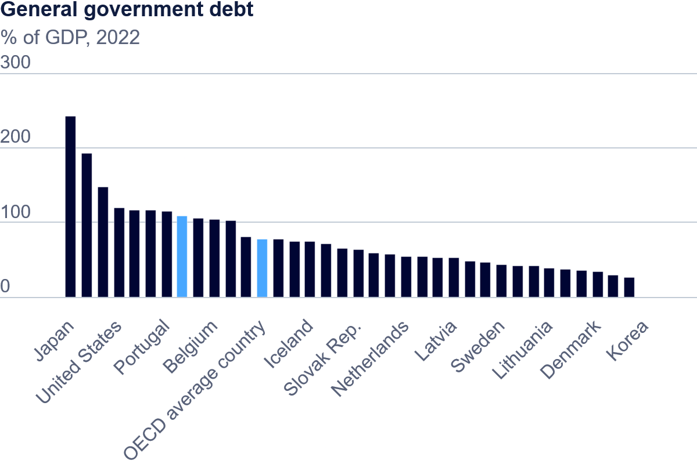

| [home page](https://vincentwang510.github.io/Vincent-Wang-Telling-Stories-With-Data/) | [visualizing debt](visualizing-government-debt) | [critique by design](critique-by-design) | [final project I](final-project-part-one) | [final project II](final-project-part-two) | [final project III](final-project-part-three) |

# Title
Text here!

## Part one: Working with web-based visualization tools and data

## Part two: Working with Tableau

<noscript></noscript><object class='tableauViz'  style='display:none;'><param name='host_url' value='https%3A%2F%2Fpublic.tableau.com%2F' /> <param name='embed_code_version' value='3' /> <param name='site_root' value='' /><param name='name' value='GovViz1&#47;Sheet1' /><param name='tabs' value='no' /><param name='toolbar' value='yes' /><param name='static_image' value='https:&#47;&#47;public.tableau.com&#47;static&#47;images&#47;Go&#47;GovViz1&#47;Sheet1&#47;1.png' /> <param name='animate_transition' value='yes' /><param name='display_static_image' value='yes' /><param name='display_spinner' value='yes' /><param name='display_overlay' value='yes' /><param name='display_count' value='yes' /><param name='language' value='en-US' /><param name='filter' value='publish=yes' /></object>
                

## Part three: My own visual

<noscript></noscript><object class='tableauViz'  style='display:none;'><param name='host_url' value='https%3A%2F%2Fpublic.tableau.com%2F' /> <param name='embed_code_version' value='3' /> <param name='site_root' value='' /><param name='name' value='GovViz2&#47;Sheet1' /><param name='tabs' value='no' /><param name='toolbar' value='yes' /><param name='static_image' value='https:&#47;&#47;public.tableau.com&#47;static&#47;images&#47;Go&#47;GovViz2&#47;Sheet1&#47;1.png' /> <param name='animate_transition' value='yes' /><param name='display_static_image' value='yes' /><param name='display_spinner' value='yes' /><param name='display_overlay' value='yes' /><param name='display_count' value='yes' /><param name='language' value='en-US' /><param name='filter' value='publish=yes' /></object>
                

This visualization is created using OCED dataset to represent the changes in GDP and debt ratio from 1994-2019 for the United States, Canada and Mexico. 

##Explanation 

For this assignment, we had to create three seperate graphs using data that discuseed the relationship between debt and gross domestic product. Gross Domestic Product (GDP) is a monetary value that measures the total market value of all goods and services produced within a country's borders during a specific time period. Essentially, countires use it to guage the performance of their economy. 

In the first graph, we can see numerous countries that are sorted by the % of debt in comparision to their GDP for 2022. First and foremost, the title of general government debt does not really tell the story of the data. The title is so generalized, the reader does not know the context. Another issue is that there are more black bars than countires listed in the x-axis. The reader has no idea which country is attributed to which bar nor what other countires are inside the visual. The designer also added 2 bars that blue that has no context nor label. Honestly, its very confusing for the viewer. The y-axis range and labels are good and the reader can match where the bar meets the respective tick on the y-axis. 

The second graph represnts the same concept, however the graph ranges from 1995 to 2019. This visualization is a heat map that has two contrasting colors on the each specturm of the range. I like that the reader understand that each row corresponds with a country and each column corresponds to a certain year. One critism I have of the use of color is that they use a stronger orange color to signal to the reader that the country is has over 100% of their GDP in debt but use blue to signify that debt is less than 100%. I think it would be better to use a red/green scale to tell the reader that red is "bad/more" and green is "good/less." This woudl work only for countries that use this context (i.e. not CHINA). This graph is an improvement on the first graph because the viewer can see each country that is within the dataset and it tells more of a story than the first graph. I wish that we could have added a shade of light gray to repace the blank white space for when we do not have data for a specific year. Although the design is better than the first visualization, I believe that the viewer will be overhelmed by the amount of data that is presented in one visualization. Maybe we could made a few different of the same heat maps but seperate them by regions? The title I gave this visual is simple and tells the reader what the data is about. I was not really sure how to create a title that would help the reader understand the trends of the data. 

The third visualization that I created used the same data set of visualization 2 but I used a subset of the data that only included North American countries that were in the data set. The first idea I had after completing the second visual was that I felt as if there was no much data on the second visual, thus I wanted to create a single example of one region's change in GDP and Debt ratio. By segregating by regions, I thought that we could change the graph type to better help the reader visualize the trend over time. In this case, I knew that a line graph would be the best graph to display change over time. In this visualization, it is easy for the reader to see that in between 2006-2010, there is a stark increase in the GDP-Debt ratio for all three countries. I also used the three main colors blue, red and green to signify Canada, the US and Mexico respectively. Again, I think that this makes it easier for the reader to digest the data and to see the trends. This graph is much simpler than the prior two graphs and the reader can immediately grasp the idea of the context. The title uses times new roman font as Tableau does not carry Sans Sarif. 

As I examine the third graph again, I would correct two things. Firstly, I should shift the title to be left aligned. Secondly, I should place a dotted line on the year 2008 to represent the 2008 recession. That could have played a role in countries taking on more debt to fix their economy? 
